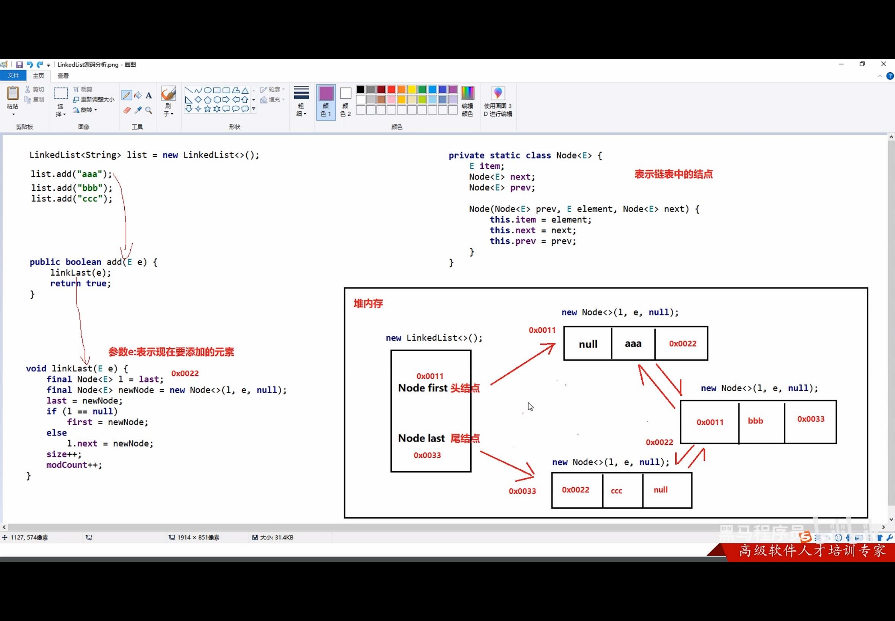

 

## 常见算法


### 基本查找

#### 二分查找/折半查找：

> <font color =red>前提条件：</font>数组中的数据必须是有序的

> <font color =red>核心逻辑：</font>每次排除一半的查找范围

定义一个最小值（`min`），一个最大值 (`max`)来确定范围。通过`（min+max）/2` 来确定中间值（`mid`）。再利用 `mid` 查询数组（`arr`）中指向的值，查看是否大于 要查找的值（`number`）。如果 `arr[mid]` 指向的值大于 `number`，则 `max=mid -1`,反之 `min=mid+1`。以此类推，当 `arr[mid] `指向的值等于 `number` 时，算法结束。

```java
public static int binarySearch(int[] arr, int num) {
        //  定义两个范围变量值
        int min = 0;
        int max = arr.length - 1;
        while (true) {
            if (min > max) {
                return -1;
            }
            //  min和max的中间位置
            int mid = (min + max) / 2;

            if (arr[mid] > num) {
                //     num 在 mid的左边
                max = mid - 1;
            } else if (arr[mid] < num) {
                //  num 在 mid 的右边
                min = mid + 1;
            } else if (arr[mid] == num) {
                //  num 跟mid 指向的元素一样
                return mid;
            }
        }
}
```


#### 插值查找：

> 公式： `mid = min + ((key - arr[min]) / (arr[max]- arr[min])) * (max -min)`


#### 分块查找

将数据分成N块，块与块之间不能有重复数据交集。块中最大值不能大于另一块中的所有数据。将每一块对象放入一个数组中，便于管理。当查找某个元素是否在数据中时，可先查询数据是否在 某个分块里，在遍历分块中的最小索引、最大索引，查找到元素所在的索引。

```java
package com.learn.search;
public class A03_BlockSearchDemo1 {
    public static void main(String[] args) {

        int[] arr = {16, 5, 9, 12, 21, 18,
                32, 23, 37, 26, 45, 34,
                50, 48, 61, 52, 73, 66};

        //  创建三个块对象
        block b1 = new block(21, 0, 5);
        block b2 = new block(45, 6, 11);
        block b3 = new block(73, 12, 17);

        //  定义数组来管理三个块的对象（索引表）
        block[] blockArr = {b1, b2, b3};
        //  需要查找的元素
        int number = 51;

        int index = getIndex(blockArr, arr, number);
        System.out.println(index);
    }
    //  利用分块查找原理， 查找元素所在的索引
    private static int getIndex(block[] blockArr, int[] arr, int number) {
        //  返回 blockArr对象索引
        int blockIndex = getBlock(blockArr, number);
        if (blockIndex == -1) {
            return -1;
        }
        //  获取元素所在块中的 起始索引 与 结束索引
        int startIndex = blockArr[blockIndex].getStartIndex();
        int endIndex = blockArr[blockIndex].getEndIndex();

        //  遍历
        for (int i = startIndex; i <= endIndex; i++) {
            if (arr[i] == number) {
                return i;
            }
        }
        return -1;
    }

    //  查找元素在哪个块里
    private static int getBlock(block[] blockArr, int number) {
        for (int i = 0; i < blockArr.length; i++) {
            if (blockArr[i].getMax() >= number) {
                return i;
            }
        }
        return -1;
    }
}

class block {
    private int max;    //  最大值
    private int startIndex; //  起始索引
    private int endIndex;   //  结束索引

    public block() {
    }

    public block(int max, int startIndex, int endIndex) {
        this.max = max;
        this.startIndex = startIndex;
        this.endIndex = endIndex;
    }

    public int getMax() {
        return max;
    }
    public void setMax(int max) {
        this.max = max;
    }

    public int getStartIndex() {
        return startIndex;
    }
    public void setStartIndex(int startIndex) {
        this.startIndex = startIndex;
    }

    public int getEndIndex() {
        return endIndex;
    }
    public void setEndIndex(int endIndex) {
        this.endIndex = endIndex;
    }
}

```


### 排序算法

#### 冒泡排序：

- <font color=red>相邻的两个元素比较，小的放前面，大的放后面。</font>

```java
package com.learn.mysort;

public class A01_BubbleDemo1 {
    public static void main(String[] args) {

        //  数组
        int[] arr = {2, 4, 5, 3, 1};

        //  冒泡排序
        //  执行轮数
        for (int j = 1; j < arr.length + 1; j++) {
            //  找到最大值
            //  -j 防止越界，加减少循环次数。-j 可看作为（-1 -0）
            for (int i = 0; i < arr.length - j; i++) {
                //  i 表示数组中的每一个索引，0，1，2，3，4
                if (arr[i] > arr[i + 1]) {
                    int temp = arr[i];
                    arr[i] = arr[i + 1];
                    arr[i + 1] = temp;
                }
            }

        }
    }

}

```


#### 选择排序

- <font color=red>从 0 索引开始，拿着每一个索引上的元素与后面的元素进行比较，小的放前面，大的放后面。 </font>

```java
package com.learn.mysort;

public class A02_SelectDemo1 {
    public static void main(String[] args) {
        //  数组
        int[] arr = {2, 4, 5, 3, 1};
        //  拿着以0 索引开始的值，跟内循环的每个值进行比较，内循环结束，外循环索引加1，再进行比较
        for (int j = 0; j < arr.length; j++) {
            //  每轮找到最小值，与最小值进行位置交换。
            for (int i = 1 + j; i < arr.length; i++) {
                if (arr[j] > arr[i]) {
                    //  值的交换
                    //  arr[0]=4. arr[1]= 2;
                    //  大的值arr[0] 赋给 tem
                    int tem = arr[j];
                    //  小的值 arr[1] 赋值给 arr[0]
                    arr[j] = arr[i];
                    //  tem 赋值给 arr[1]
                    arr[i] = tem;
                    //  最后实现：
                    //  arr[0]= 2, arr[1] = 4;
                }
            }
    
        }
    }
 
}

```


#### 插入排序

- <font color=red>将数组分为有序和无序两组，遍历无需数据，将元素插入有序序列即可。</font>

```java
package com.learn.mysort;

public class A03_InsertDemo1 {
    public static void main(String[] args) {
        //  数组
        int[] arr = {3, 44, 38, 5, 47, 15, 36, 26, 27, 2, 46, 4, 19, 50, 48};
        int startIndex = -1;    //  起始索引
        //  当arr[i] > arr[i+1] 时，就意味着 arr[i] 后面的数据时无序的。
        //  此时，无序数据块的起始索引为 i+1；
        for (int i = 0; i < arr.length; i++) {
            if (arr[i] > arr[i + 1]) {
                startIndex = i + 1;
                break;
            }
        }
        for (int i = startIndex; i < arr.length; i++) {
            int j = i;
            while (j > 0 && arr[j - 1] > arr[j]) {
                //  交换位置
                int tem = arr[j];
                arr[j] = arr[j - 1];
                arr[j - 1] = tem;
                j--;
            }
        }
    }
  
}
```


#### 快速排序：

- <font color=red>将排序范围内的第一个数字作为基准数，定义两个变量 start、end</font>
- <font color=red>start 从前往后找比基准数大的，end 从后往前找比基准数小的</font>
- <font color=red>找到后，交换 start 和 end 指向的元素，并循环这一过程。知道start 与 end 同处一个位置，则该位置为基准数 在数组中应存入的位置，再让基准数归位。</font>
- <font color=red>归位后的效果：左边的比基准数小，右边的比基准数大。</font>

```java
public static void QuickSort(int[] arr, int i, int j) {
        //  要查找的范围
        int start = i;
        int end = j;

        if (start > end) {
            return;
        }

        //  基准数
        int baseNumber = arr[i];
        //  利用end ，往后遍历，找出比基准数小的数字。
        while (start != end) {
            //int[] arr = {6, 1, 2, 7, 9, 3, 4, 5, 10, 8};
            while (true) {
                if (end <= start || arr[end] < baseNumber) {
                    break;
                }
                end--;
            }

            //  利用start ， 往后遍历，找出比基准数大的数字。
            while (true) {
                if (end <= start || arr[start] > baseNumber) {
                    break;
                }
                start++;
            }
            //  交换end 与 start 指向的元素
            int temp = arr[start];
            arr[start] = arr[end];
            arr[end] = temp;
        }

        //  基准数归为
        int temp = arr[i];
        arr[i] = arr[start];
        arr[start] = temp;

        //  确定 6左边的范围
        QuickSort(arr, i, start - 1);
        //  确定6 右边的范围
        QuickSort(arr, start + 1, j);
    }
```


## Lambda表达式

1. 基本作用：简化函数式接口的匿名内部类的写法。
   - 注：带`@FunctionalInterface` 表示当前的接口就是一个函数式接口。

2. 使用前提：必须是接口的匿名内部类，接口中只能有一个抽象方法。

完整格式：

```java
（）-> {
   //	 方法体
}
```


#### 省略写法：

> - 参数类型可以省略不写
> - 如果只有一个参数，参数类型可以省略，同时（）也可以省略
> - 如果lambda 表达式的方法体只有一行，大括号，分号，return 都可以省略不写，需要同时省略。


## 集合


### 单列集合（Collection）

> <font color=red>`Collection`是单列集合的祖宗接口，它的功能是全部单列集合都可以继承使用的</font>


#### Collection 遍历

- 迭代器遍历

  - > 不依赖索引 。迭代器遍历时，无法使用集合的增加、删除。
    >
    > 如果当前位置没有元素，还强行获取，会报 NoSuchElementException
    >
    > 迭代器遍历完毕，指针不会复位。
    >
    > 循环只能使用一次 next 方法

    ```java
    //  获取迭代器对象
    //  默认指向集合的 0 索引处
    Iterator<String> itt = coll.iterator();
    //  利用循环获取集合中每一个元素
    while (itt.hasNext()) {
        //  获取元素，并移动指针
        String str = itt.next();
        System.out.println(str);
    }
    ```

    

- 增强for遍历

  - ```java
    for (String s : coll) {
                
            }
    ```

    > 修改增强 for 中的变量，不会改变集合中原本的数据。

- lambda 表达式遍历

  - ```java
    coll.forEach(System.out::println);
    
    //	coll.forEach(s -> System.out.println(s));
    ```

    

### List：

> <font color=red>添加的元素是有序、可重复、有索引的。</font>

#### `ArrayList`：

1. 利用空参创建的集合，在底层创建一个默认长度为0的数组
2. 添加第一个元素时，底层会创建一个新的长度为10 的数组
3. 存满时，会扩容1.5倍
4. 如果一次添加多个元素，1.5倍 还放不下，则新创建数组的长度以实际情况为准

#### `LinkedList`：


#### `Vector`：


#### 遍历方式

- 迭代器遍历		：遍历过程中需要删除元素，可使用。
- 列表迭代器	        ：遍历过程中需要添加元素，可使用。
- 增强for 遍历	      ：单纯遍历
- lambda 表达式          ：:arrow_up:
- 普通 for                     ：遍历时操作索引，可以使用。


### Set：

> <font color=red>添加的元素是无序、不重复、无索引的。</font>

- `HashSet`
  - `LinkedHashSet`
- `TreeSet`


#### 双列集合


### 泛型

- 统一数据类型
- 


## 数据结构 （集合）

### 栈

- 特点：后进先出，先进后出。


### 队列

- 特点：先进先出，后进后出。


### 数组

- 查询速度块：通过地址值和索引位置，查询任意数据耗时相同
- 删除效率低：将原始数据删除，后面的元素都要往前移动
- 添加效率低：添加数据后，后面的元素都要往后移动


### 链表

1. 节点：存储地址值。
2. 链表增删相对块

- 链表查询慢，无论查询哪个数据都要从头开始。


### ArrayList 底层 （代）


### LinkedList 底层





### 迭代器底层


