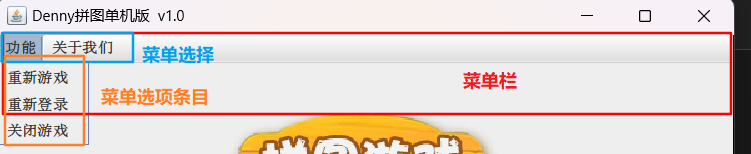
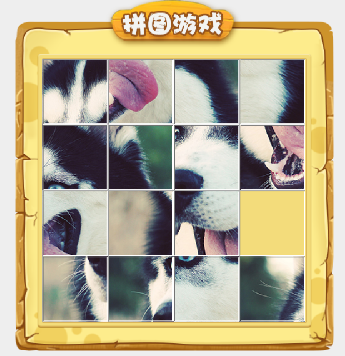

# 拼图游戏项目


## 所需的类跟方法

### 界面内容

1. `JFrame()` 修饰界面 **(直接继承 ，可`this.`调用赋值)**

   - `setSize` ：设置界面宽高
   - `setTiltle` ：设置标题
   - `setAlwaysOnTop(true)`：设置界面置顶 true/false
   - `setLocationRelativeTo(null)`：设置界面居中
   - `setDefaultCloseOperation(EXIT_ON_CLOSE);`： 设置关闭模式
   - `setLayout(null)`：取消默认居中放置，只有取消了才会按照自定义的形式添加组件
   - `setVisible(true);`：让界面展现出来 **true / false**

   1. `this.getContentPane().removeAll();` ：清除已存在的组件
   2. `this.getContentPane().repaint();`：重新绘制此组件
   3. `this.getContentPane().add(jLabel);` ：把容器添加到界面中

2. `JMenuBar()` 菜单栏

   - `JMenu`：菜单选项
     - `JMenuItem`：选择条目对象

   > 可以看作为   `JMenuBar` :arrow_right: 一级菜单，`JMenu`:arrow_right:二级菜单 ，`JMenuItem`:arrow_right:三级菜单；

3. `JLabel` 图片容器

   - `new JLabel(new ImageIcon( "path" ))`：将图片放入容器里
   - `setBounds()`：设置大小位置

4. `JButton()`  按钮容器

   - `setBounds()`：设置大小位置

5. `JDialog` 弹窗

   - `jDialog.getContentPane().add(jLabel);`：把图片添加到弹窗里
   - `setSize()`：设置弹窗宽高
   - `setAlwaysOnTop(true);`：设置弹窗置顶
   - `setLocationRelativeTo(null)`：设置弹窗居中
   - `setModal(true)`：弹窗不关闭，则无法继续操作
   - `setVisible(true)`：显示弹窗

### 事件监听(接口)

1. `MouseListener` 鼠标事件 （按下、释放、单击、进入和退出）
   - `login.addMouseListener(this);`：绑定监听事件
2. `ActionListener` 单击事件
   - `JButton.addActionListener(this);`：绑定监听事件
3. `KeyListener` 键盘事件 
   - `this.addKeyListener(this);`：给整个界面绑定键盘监听事件


## UI界面

### 最外层窗体。

通过 `JFrame` 这个类来设置，

游戏主页面（登入页面/注册页面） 类似，修改参数即可

```java
public class GameJFrame extends JFrame {

	private void initJFrame() {
            // 设置界面宽高
            this.setSize(603, 680);
            // 设置标题
            this.setTitle("Denny拼图单机版  v1.0 ");
            //  设置界面置顶
            this.setAlwaysOnTop(true);
            //  设置界面居中
            this.setLocationRelativeTo(null);
            //  设置游戏关闭模式
            this.setDefaultCloseOperation(WindowConstants.EXIT_ON_CLOSE);

            //  取消默认居中放置，只有取消了才会按照自定义的形式添加组件
            this.setLayout(null);
			
                //让界面展现出来
        	this.setVisible(true);
         }
}
```

### 最上层的菜单



（菜单栏）`JMenuBar` $\rightarrow\ $（菜单选项）`JMenu` $\rightarrow\\$（选项条目）`JmenuItem`

#### 通过 `JMenuBar` 这个类来实现菜单栏

```java
        //  初始化菜单
        //  创建菜单对象
        JMenuBar jMenuBar = new JMenuBar();
```

#### 在菜单上定义菜单选项

```java
 //  创建菜单上面的两个选项（功能，关于我们）
        JMenu functionJMen = new JMenu("功能");
        JMenu aboutJMen = new JMenu("关于我们");
```

#### 在选项下定义条目

```java
//  创建选项下面的条目对象

        JMenuItem replayItem = new JMenuItem("重新游戏");
        JMenuItem reLoginItem = new JMenuItem("重新登录");
        JMenuItem closeItem = new JMenuItem("关闭游戏");

        JMenuItem accountItem = new JMenuItem("公众号");
```

#### 然后再给整个界面设置菜单

```java
//  将每一个选项下面的条目添加到选择中
        functionJMen.add(replayItem);
        functionJMen.add(reLoginItem);
        functionJMen.add(closeItem);

        aboutJMen.add(accountItem);

//  将菜单里的两个选项添加到菜单中
        jMenuBar.add(functionJMen);
        jMenuBar.add(aboutJMen);

//给整个界面设置菜单

        this.setJMenuBar(jMenuBar);
```

### 添加图片



#### 添加图片需要以下 类/方法

- `JLable`：管理容器

- `ImageIcon`：用于加载图像

  ```java
  //  创建一个JLabel 对象（管理容器）
  JLabel jLabel = new JLabel(new ImageIcon("LearningProjects\\image\\animal\\animal3\\" + num + ".jpg"));
  ```

- `jLable.setBounds`：设置图片位置

- `JLable.setBoder`：给图片添加边框

#### 添加图片完整代码块

```java
private void initImage() {


        //  外循环----   重复添加4行
        for (int i = 0; i < 4; i++) {
            //  内循环---- 在一行内添加4张图片
            for (int j = 0; j < 4; j++) {
                //  获取需要加载图片的序号
                int num = data[i][j];
                //  创建一个JLabel 对象（管理容器）
                JLabel jLabel = new JLabel(new ImageIcon("LearningProjects\\image\\animal\\animal3\\" + num + ".jpg"));
                //  指定图片位置
                jLabel.setBounds(105 * j + 83, 105 * i + 134, 105, 105);

                //  给图片添加边框
                jLabel.setBorder(new BevelBorder(BevelBorder.LOWERED));

                //  把容器添加到界面中
                this.getContentPane().add(jLabel);
            }
        }
```

> 如需实现图片是打乱添加的还需初始化数据（打乱），然后再根据打乱后的数据添加。

#### 打乱数据

```java
private void initData() {
    // 1.   定义一个数组
    int[] tempArr = {0, 1, 2, 3, 4, 5, 6, 7, 8, 9, 10, 11, 12, 13, 14, 15};
    //2.    打乱数组
    //  遍历数组，得到每个元素，拿着每个元素更索引上的数据进行交换
    Random r = new Random();
    int length = tempArr.length;
    for (int i = 0; i < length; i++) {
        //  获取到随机的索引
        int index = r.nextInt(length - 1);
        //  拿着遍历每一个数据，跟随机索引上的数据进行交换。
        int temp = tempArr[i];
        tempArr[i] = tempArr[index];
        tempArr[index] = temp;
    }
     /*给二维数组添加数据
      遍历一维数组tempArr 得到每一个元素，把每一个元素依次添加到二维数组中
      */
    for (int i = 0; i < tempArr.length; i++) {
        /*
         * 一维索引:[i/4],[i%4]
         *  0:0,0   1:0,1  2:0,2  3:0,3  4:1,0  5:1,1  6:1,2  7:1,3  8:2,0  9:2,1  10:2,2 11:2,3 12:3,0 13:3,1 14:3,2 15:3,3
         */
        data[i / 4][i % 4] = tempArr[i];
    }

}
```

## 业务逻辑

#### 图片移动

- 实现KeyListener 接口，并重写所有抽象方法

- 给整个界面添加键盘监听事件

- 统计一下空白方块对应的数字0 在二维数组中的位置

- 在KeyReleased 方法中实现移动逻辑

- Bug 修复：

  - 空白方块在最下方时，无法再次下移
  - 空白方块在最上方时，无法再次上移
  - 空白方块在最左方时，无法再次左移
  - 空白方块在最右方时，无法再次右移

  ```java
  public void keyReleased(KeyEvent e) {
      //  对上，下，左，右进行判断
      //  左：37，上：38，右：39，下：40
      int code = e.getKeyCode();
      if (code == 37) {
          /*  逻辑：
           *   x,y 表示空白方块
           *   x,y-1 表示空白方块下的数字
           */
          
  		//        Bug 修复
          System.out.println("向左移动");
          if (y == 0) {
              return;
          }
          //  把空白方块左边的数字赋值给空白方块
          //  3,3 >  3,2 >  3,1
          data[x][y] = data[x][y - 1];
          data[x][y - 1] = 0;
          y--;
          //  调用方法按照最新的数字加载图片
          initImage();
  
      } else if (....){.....}
  
  }
  
  
      private void initImage() {
          //  清空原本已存在的所有图片
          this.getContentPane().removeAll();
          
          
          ........
          
                  //  刷新界面
          this.getContentPane().repaint();
          
      }
  
  ```

